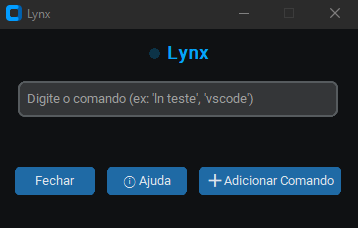
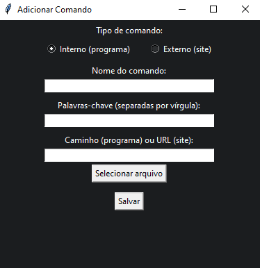
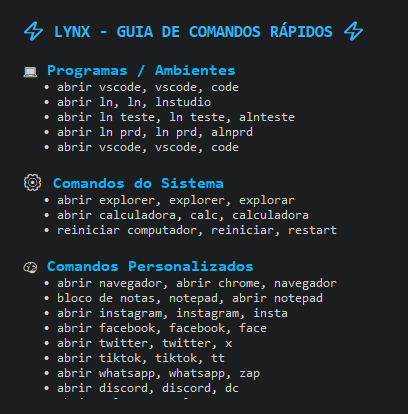

<!-- Banner central -->
<div align="center">
  
  
  
</div>

<h1 align="center">Lynx Assistant</h1>

<p align="center">
  <b>O poder dos comandos rápidos — na ponta dos seus dedos.</b><br/>
  Um assistente desktop inteligente para abrir programas, sites e ambientes com naturalidade.
</p>

<div align="center">
  
  
  
  
  
  
  
  
</div>


---

## Visão Geral

O **Lynx Assistant** é um assistente desktop open source criado para
**executar comandos e automações com linguagem natural**.\
Com ele, é possível abrir programas, sites ou ambientes de trabalho
usando instruções simples como:

``` bash
ln teste
abrir vscode
abrir youtube
```

Desenvolvido em **Python**, com interface moderna via **CustomTkinter**,
o Lynx combina **rapidez, modularidade e uma experiência fluida** de uso
no desktop.

------------------------------------------------------------------------

## Principais Recursos

-   **Comandos naturais** --- esqueça sintaxes complicadas; use
    linguagem comum.\
-   **Aprendizado adaptável** --- adicione e edite comandos pelo próprio
    app.\
-   **Interface moderna (CustomTkinter)** --- tema escuro, clean e
    responsivo.\
-   **Integrações locais e web** --- do VSCode ao LinkedIn.\
-   **Persistência local** --- armazenamento seguro e transparente via
    `commands.json`.\
-   **Extensível** --- pronto para receber novas engines e módulos.

------------------------------------------------------------------------
## Interface

<div align="center" style="display: flex; gap: 20px; justify-content: center;">

  <div style="text-align: center;">
    
    <p><b>Tela Principal</b></p>
  </div>

  <div style="text-align: center;">
    
    <p><b>Adicionar Comando</b></p>
  </div>

  <div style="text-align: center;">
    
    <p><b>Ajuda Expandida</b></p>
  </div>

</div>


------------------------------------------------------------------------

## Instalação

``` bash
# Clone o repositório
git clone https://github.com/gabriel-araujo-git/lynx-assistant.git
cd lynx-assistant

# Instale as dependências
pip install -r requirements.txt

# Execute o Lynx
python assistant_ui.py
```

O aplicativo será iniciado em modo janela e adicionará um ícone na
bandeja do sistema.\
Você pode ocultá-lo e reabrir a qualquer momento.

------------------------------------------------------------------------

## Estrutura do Projeto

    lynx-assistant/
    │
    ├── assistant_ui.py        # Interface principal (UI + Command Engine)
    ├── commands.json          # Banco local de comandos
    ├── requirements.txt
    ├── LICENSE
    ├── README.md
    ├── CHANGELOG.md
    ├── CONTRIBUTING.md
    └── docs/
        ├── screenshot_main.png
        ├── screenshot_help.png
        └── screenshot_add.png

------------------------------------------------------------------------

## Adicionando Novos Comandos

No aplicativo, selecione **Adicionar** e defina:

  Campo            Descrição
  ---------------- ---------------------------------------
  Tipo             Interno (programa) ou Externo (site)
  Nome             Nome do comando
  Palavras-chave   Termos que acionam o comando
  Caminho / URL    Caminho do executável ou link do site

O Lynx salva as informações automaticamente em `commands.json`.

------------------------------------------------------------------------

## Stack Técnica

-   Python 3.10+
-   CustomTkinter
-   PyStray
-   Pillow
-   Subprocess / Webbrowser


------------------------------------------------------------------------

## Documentação Detalhada

A documentação técnica foi dividida em seções independentes dentro do diretório `docs/` para facilitar a navegação e manutenção:

- [Guia de Instalação e Configuração](docs/setup.md)
- [Guia de Uso e Exemplos](docs/usage.md)
- [Arquitetura e Estrutura Interna](docs/architecture.md)
- [Roadmap e Planejamento Futuro](docs/roadmap.md)

Esses arquivos seguem o mesmo padrão de estilo do projeto principal, utilizando badges informativas e linguagem técnica consistente.

------------------------------------------------------------------------

## Contribuição

Contribuições são bem-vindas. Consulte o arquivo [CONTRIBUTING.md](CONTRIBUTING.md) 
antes de enviar um pull request.

------------------------------------------------------------------------

## Licença

Distribuído sob a licença MIT. Consulte o arquivo [MIT](LICENSE). para mais
detalhes.
